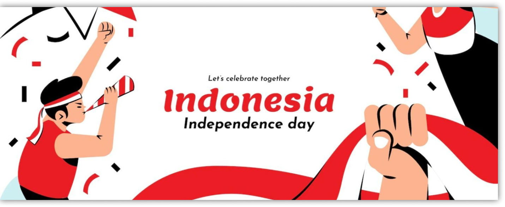
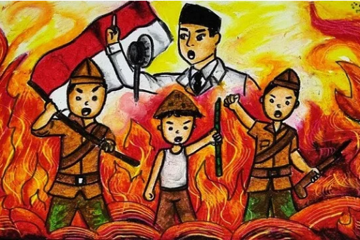

# Melukis Dengan Tema HUT RI

&nbsp;&nbsp;&nbsp;&nbsp;Pada kelas ini kamu akan belajar dimulai dari pengenalan tentang melukis, alat dan bahan apa saja yang harus disiapkan dan seperti apa teknik dasar menggunakan kuas. Di akhir kelas kamu diharapkan bisa membuat lukisan sesuai dengan kreativitasmu.

### Ketentuan

&nbsp;&nbsp;&nbsp;&nbsp;Di akhir kelas kamu diharapkan bisa membuat lukisan sesuai dengan kreativitasmu.Peserta membuat lukisan dengan tema “HUT RI ke-77” dengan ketentuan:

1. Lukisan harus secara manual (handmade art) dan harus sesuai dengan tema yang telah ditentukan.
2. Setiap peserta dapat membuat karya dengan media drawing paper atau canvas.
3. Alat lukis, teknik dan gaya yang digunakan bebas, disesuaikan dengan kemampuan dan konsep karya masing-masing peserta.
4. Lukisan tidak mengandung unsur SARA dan pornografi
5. Peserta mengirimkan foto karya, foto proses karya, dan foto bersama karya lukisan diunggah ke dalam drive peserta dengan format JPEG/JPG dan resolusi minimal 300dpl.

### Contoh karya

