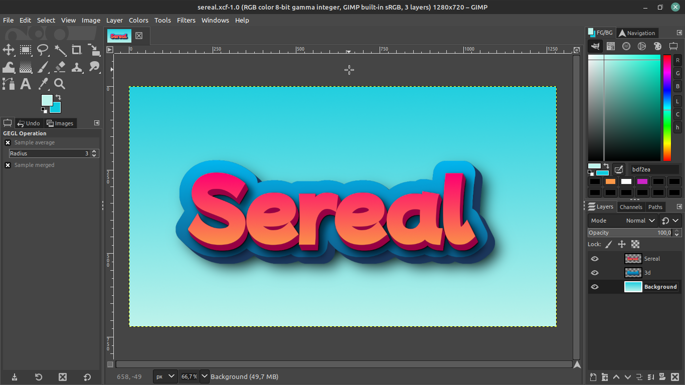
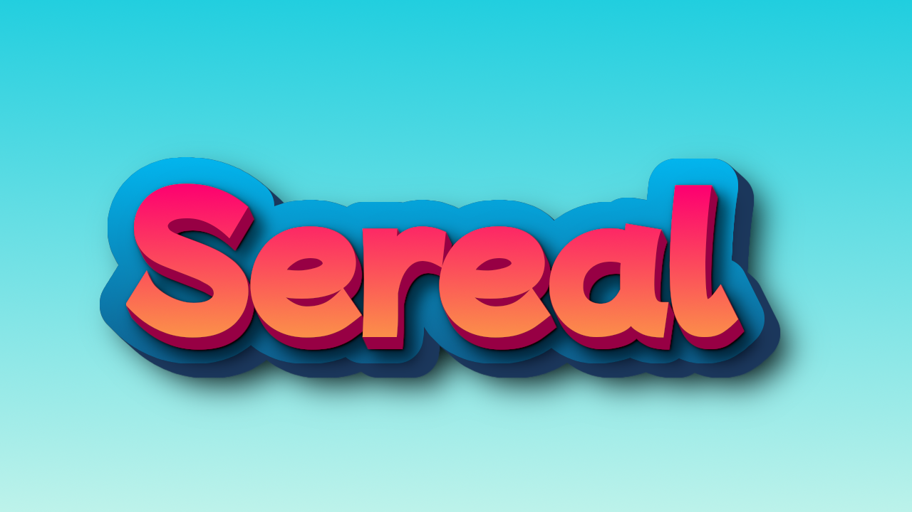

# GIMP Dasar

### Pendahuluan

##### 1. Apa itu gimp

&nbsp;&nbsp;&nbsp;&nbsp;Dibandingkan menggunakan Tools edit gambar yang berbayar seperti _Adobe Photoshop_, _CorelDraw_, dan lain lain. Untuk anda yang kaum gratisan bisa mencoba alternatif lain yang tidak kalah keren daripada software edit gambar yang berbayar tadi. **_GNU Image Manipulation Program_** atau lebih sering dikenal dengan sebutan GIMP merupakan perangkat lunak edit gambar **(G R A T I S)**. GIMP sendiri dapat dimanfaatkan untuk membuat grafik dan logo, mengubah resolusi dan memotong foto, mengubah warna, menggabungkan berbagai macam gambar atau mengkonversi berbagai macam jenis berkas gambar dan masih banyak lagi. Grafik yang dihasilkan oleh GIMP disimpan dengan format XCF dan bisa diekspor ke berbagai format gambar seperti `bmp`, `jpg`, `gif`, `pdf`, `png`, `svg`, `tiff`, dan masih banyak lagi yang lainnya. Dengan banyaknya plugin yang memudahkan dalam mengelolah gambar (image) dengan cepat, anda bisa sah sah sah sah tugas selesai…. Selain itu juga Developer GIMP selalu menambahkan teknologi terbaru setiap updatenya untuk selalu mengikuti perkembangan teknologi, so jangan khawatir untuk belajar GIMP..

##### 2. GIMP interface (tampilan)

[Link vidoe](https://www.youtube.com/watch?v=Rv36bite-YI&list=PLncito6z-hVHbm_Zsv7iJSRhi4fz-B5fp&index=1&ab_channel=AbuZaidTutorial)

&nbsp;&nbsp;&nbsp;&nbsp;Silahkan menonton video di atas dengan seksama, harapannya setelah menonton video di atas kamu bisa mengetahui interface dasar dari GIMP dan kamu juga bisa mengkostumisasi tampilan dengan kenyamanan kamu sendiri.

### Tools/Alat:

##### 1. Move tool

[link video](https://www.youtube.com/watch?v=zhw58HI2STM&list=PLncito6z-hVHbm_Zsv7iJSRhi4fz-B5fp&index=2&ab_channel=AbuZaidTutorial)

&nbsp;&nbsp;&nbsp;&nbsp;Silahkan menonton video diatas dengan seksama, harapannnya setelah menonton vidoe diatas kamu mampu memindahkan object-object meggunakan move tool.

##### 2. Alingment tool

[link vidoe](https://www.youtube.com/watch?v=9ShYQ6Bujow&list=PLncito6z-hVHbm_Zsv7iJSRhi4fz-B5fp&index=3&ab_channel=AbuZaidTutorial)

&nbsp;&nbsp;&nbsp;&nbsp;Silahkan menonton video diatas dengan seksama, harapannnya setelah menonton vidoe diatas kamu mampu membedakan fungsi-fungsi alingment tools, mengatur jarak distribusi, center dan lainn sebagainya.

##### 3. Selection tool

[link vidoe](https://www.youtube.com/watch?v=riValOYXiGI&list=PLncito6z-hVHbm_Zsv7iJSRhi4fz-B5fp&index=4&ab_channel=AbuZaidTutorial)

&nbsp;&nbsp;&nbsp;&nbsp;Silahkan menonton video diatas dengan seksama, harapannnya setelah menonton vidoe diatas kamu mampu membedakan menyeleksi gambar atau object, mengatur ketebalan seleksi mengerti fungsi fungsi tambahan dari selection tool.

##### 4. Text tool

[link vidoe](https://www.youtube.com/watch?v=k7SrQ-_-8zc&ab_channel=TJFREE)

&nbsp;&nbsp;&nbsp;&nbsp;Silahkan menonton video diatas dengan seksama, harapannnya setelah menonton vidoe diatas kamu dapat memodifikasi text, mengatur jarak, tata letak dan sebagainya

### Exercise 1: Membuat stroke pada text

[link vidoe](https://www.youtube.com/watch?v=8X1kiGvOTYg&list=PLncito6z-hVHbm_Zsv7iJSRhi4fz-B5fp&index=5&ab_channel=AbuZaidTutorial)

&nbsp;&nbsp;&nbsp;&nbsp;Silahkan menonton video diatas dengan seksama, harapannnya setelah menonton vidoe diatas kamu mampu membuat stroke dengan 3 metode yang sudah dijelaskan. Jangan cuman di tonton yah deck, di peraktekin juga biar jago!

### Exercise 2: Membuat text 3D

[link vidoe](https://www.youtube.com/watch?v=kOBUiBnLBKc&ab_channel=YellowDigitalTutorials)

&nbsp;&nbsp;&nbsp;&nbsp;Silahkan menonton video diatas dengan seksama, harapannnya setelah menonton vidoe diatas kamu mampu membuat text dengan stroke menggunakan nama kamu sendiri. Kembangkan lagi imajinasi kamu dengan warna kesukaanmu. Font yang dipakai [mochi](https://fonts.google.com/specimen/Mochiy+Pop+P+One?query=mochi). Jika kamu mau fontnya berbeda silahkan mencari font sendiri di google yah deck! Link untuk menari [font](https://fonts.google.com) keren. Contoh punya sereal

- proses pembuatan

- hasil

